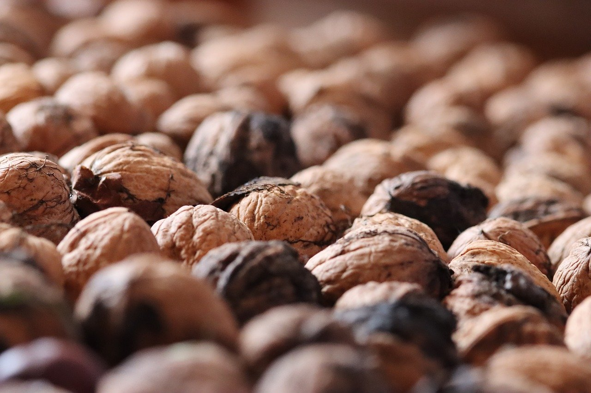

Les institutions de l'écosystème traditionnel s'emparent peu à peu des
nouveaux outils de communication pour assurer la
promotion de leurs auteurs par de nouveaux canaux. Ainsi de Jean-Paul Hirsch, dont la
[chaîne](https://www.youtube.com/channel/UCPkZC9j2_jcyAx8CBKXHoQA) archive des entretiens *homemade* pour le compte de P.O.L.
Mais depuis plusieurs années les plateformes de partage de vidéos comme
YouTube sont également devenues des lieux de diffusion et de circulation
de nouvelles formes promotionnelles pour le secteur de l'édition :
*book trailers* et autres *teasers* vidéo font désormais partie du bagage
promotionnel commun entourant la parution d'un livre aux côtés des
campagnes d'affichages,  rencontres-signatures et lectures
publiques[^1]. Or cette forme donne également lieu à des investissements poétiques qui en brouillent les fonctions.

Défini par Sylvie Decaux et Xavier Sense comme « une forme discursive pluri-sémiotique ayant pour fonction
de faire la promotion d'un livre » [-@decaux_litterature_2012, p. 405], le *book trailer* ou « bande-annonce de livre » est un genre publicitaire plutôt en usage pour la promotion de romans à fort potentiel de vente, romans de genre,
polars, ou encore la littérature jeunesse. Tourné vers le
divertissement, le spectacle, le *trailer* use de l'image animée, comme
moyen d'attirer des non lecteurs à la lecture, de susciter l'intérêt par
des moyens sémiotiquement hétérogènes à l'écrit, ce qui lui vaut de
nombreuses critiques et procès en trahison, ainsi qu'un rejet ou -- le
plus souvent -- une parfaite indifférence du côté de la littérature dite
expérimentale. Secteur traditionnellement peu vendeur, la poésie
contemporaine semble en effet peu concernée par de telles stratégies
publicitaires. Le *book trailer* et son associé le *teaser* vidéo
semblent de fait peu adaptés, voire antithétiques de ces formes
poétiques, en raison de leur accointance plus évidente avec le genre
romanesque d'une part, la logique de best-seller et de vente massive qui
y est associée d'autre part.

Certaines maisons éditant de la poésie ont toutefois recours à des
formes de promotion vidéo : c'est notamment le cas de l'éditeur P.O.L
qui, depuis une dizaine d'années, propose sur [son site](https://www.pol-editeur.com/pol-videos-sons.html) et [la chaîne
YouTube associée](https://www.youtube.com/user/jeanpaulhirsch) des « vidéolectures », lectures à voix haute face
caméra par les auteurs d'extraits de leur livre en cours de parution.
Ces vidéolectures rejoignent, et prolongent par une diffusion numérique
plus large, les lectures publiques à vocation promotionnelle désormais
florissantes dans les librairies et autres institutions, stratégies
publicitaires tablant sur l'incarnation du poète[^100]. Le même éditeur
renouvelle également, toujours dans ces capsules vidéo, le genre de
l'entretien d'écrivain. À chaque nouvelle sortie un auteur vient ainsi
parler de son livre face à la caméra, filmé dans les locaux de la maison
d'édition. Mais si les entretiens d'écrivains et lectures à voix haute
filmées font partie des formes possibles de *book trailer* tablant sur
la « promotion par l'information » selon Sylvie Decaux et Xavier
Sense [-@decaux_litterature_2012, p. 409], il ne s'agit en somme que de la reconduction de formes
péritextuelles déjà à l'œuvre dans d'autres contextes, là où la
bande-annonce de livre stricto-sensu et le *teaser* proposent une
manière inédite dans le champ littéraire.

Le champ de la poésie contemporaine est, d'autre part, marqué par de
multiples phénomènes d'intermédialité : la mise en images et en sons du
poème y est à l'œuvre au sein de formes plurisémiotiques, et la vidéo
peut aussi être un outil de création à part entière, de
vidéoperformances et autres vidéopoèmes qui ne sont pas nécessairement
reliés à un livre publié. La performance comme la vidéo sont alors des
modalités d'implémentation du poème, de publication du poème hors livre
et ne relèvent en rien d'une relation qui serait d'ordre péritextuel à
une œuvre princeps qu'elles auraient pour tâche de promouvoir. Ce type
d'œuvre se déploie alors bien souvent hors de la chaîne traditionnelle
du livre de par ses supports hétérogènes, et sa relation avec ces
stratégies publicitaires semble bien lointaine.

Pourtant, la dichotomie apparente entre ce qui relèverait du clip
promotionnel d'une part et de la création de vidéopoèmes d'autre part
semble mise à mal par l'existence d'un certain nombre d'objets
vidéographiques en circulation sur le Web. Les réalisations que nous
nous proposons d'envisager interrogent en effet d'abord par l'ambiguïté
de leur statut : leur vocation promotionnelle affichée ne semble pas
corroborée par leur mode de diffusion ni même par leur contenu. Elles
émanent d'auteurs dont l'œuvre se déploie autant en performance et en
vidéo que dans le livre. Leur relation à l'objet livresque dont elles
sont censées opérer la promotion en devient alors problématique. Ainsi
François Bon parle-t-il, à la découverte de la série des *teasers*
réalisés par Nathalie Quintane et publiés durant les quatre mois
précédant la parution de *Descente de médiums* [-@quintane_descente_2014] sur le site des éditions
P.O.L, d'« anti-*teasers* promotionnels » [-@bon_pari_2014]. Assumant l'« écart de
création », ces *teasers* ainsi pourtant nommés par leurs auteurs, sont
conçus par les poètes eux-mêmes, à l'instar des trois vidéos réalisées
par Patrick Bouvet et le vidéaste Terence Meunier pour la parution de
*Pulsion lumière* [-@bouvet_pulsion_2012], *Carte son* [-@bouvet_carte_2014] et *Petite histoire du spectacle industriel* [-@bouvet_petite_2017], tous trois aux éditions de l'Olivier. Que deviennent ces
genres communicationnels que sont le *teaser*, le vidéoclip et le *book trailer* lorsque des poètes expérimentaux s'en emparent ? Quelles
relations ces corpus *a priori* promotionnels entretiennent-ils avec les
autres productions hors livre de ces poètes ? Notre corpus se limitera
ici à deux séries de vidéos, toutes désignées comme *teasers* de
plusieurs ouvrages de Nathalie Quintane et de Patrick Bouvet.

## Des *teasers* ? Fonctionnement rhétorique

Le premier point commun à ces vidéos est d'afficher clairement leur
genre. Les métadonnées éditoriales qui s'inscrivent autour de la vidéo
sur leur site de diffusion, YouTube, l'indiquent sans ambiguïté. On lit
ainsi sous la vidéo de Patrick Bouvet « Carte son », un titre, qui
indique un genre entre parenthèses : « Carton son (teaser) ».
Conformément à son statut annoncé, la vidéo évoque un livre qui n'est
pas encore paru, ce que confirment les dates : 

> Vidéo ajoutée le 5 mars
2014, « Nouveau livre de Patrick Bouvet "Carte son", parution en avril
2014 aux éditions de l'Olivier. 

Le nom de l'auteur, le titre du livre,
le nom de l'éditeur sont clairement mentionnés. On retrouve les
informations nécessaires à la promotion d'un ouvrage à venir. Il en va
de même pour « Petite histoire du spectacle industriel » : le *teaser*
est posté en février 2017, et affiche les informations relatives à la
parution en mars 2017 du livre aux mêmes éditions.

En 2018, Guillaume Vissac[^5], publie chez Othello une version livresque
d'*Accident de personne* [-@vissac_accident_2018], le qualifiant de « roman en pièces détachées ». Œuvre transmédiatique sur les suicidés du métro, cette dernière avait en effet d'abord été écrite au fil de l'eau durant un an et demi sur Twitter[^6] en 2010, puis connu une mise en livre numérique sur Publie.net en 2011[^102]. Les cinq vidéos postées sur la chaîne YouTube de l'auteur en 2018, nommées « *teasers* », coïncident avec la sortie annoncé du livre. D'une durée de trente secondes en moyenne, ces très courtes vidéos présentent chacune des vues en travelling prises à bord du métro, ou dans des stations, et en
surimpression d'autres silhouettes fantomatiques, inquiétantes, pendant
que des voix multiples lisent des extraits de l'ouvrage, avant de céder
la place à l'image de la couverture du livre à venir.

Les vidéos de Nathalie Quintane usent du même vocabulaire marketing pour
se désigner : la vidéo de *Crâne chaud* est ainsi légendée « Bande-annonce du prochain livre de Nathalie Quintane. Éditions P.O.L -- octobre 2012 », et la série réalisée pour *Descente de médiums* en mars
2014 est indiquée comme « film [...] à l'occasion de la parution de
*Descente de médiums* aux éditions P.O.L avril 2014 ».

Il convient donc dans un premier temps d'aborder ces vidéos en fonction
de leur statut promotionnel affiché. Les envisager depuis ce statut
implique d'en considérer le fonctionnement comme « genre paratextuel
intermédial » [@gron_literary_2014] et le fonctionnement rhétorique, puisque comme le
rappellent Sylvie Decaux et Xavier Sense,

>le book trailer est un document visuel et sonore véhiculant un message
intentionnel et persuasif. Intentionnel parce qu'il est relatif à un
livre, et persuasif parce qu'il met en place une argumentation qui vise
à produire un effet : susciter l'intérêt du lecteur et, par-là, inciter
l'acte d'achat [-@decaux_litterature_2012, p. 405].

Ces objets relèvent d'une « communication publicitaire et commerciale ».
Contrairement aux autres péritextes le *book trailer* inclut une
dimension iconique, et non seulement une description verbale. Il produit,
selon Rasmus Grøn, une « suggestion audiovisuelle des caractéristiques
du texte » [-@gron_literary_2014]. Observons donc la manière dont s'opère cette suggestion
audiovisuelle dans notre corpus.

La vidéo de *Crâne chaud* de Nathalie Quintane est désignée comme « bande-annonce ». Elle relève du *book trailer* et décline en effet quelques-uns des codes de la bande-annonce de livre, eux-mêmes empruntés
aux bandes-annonces cinématographiques.

On y découvre trois petites séquences, très courtes, suivies d'un carton
final où se lisent les informations attendues sur le livre à venir. Dans
de nombreux *book trailers*, la vidéo met en images des fragments de
situations extraites du livre, ou évoque par divers procédés une
atmosphère, lorsque le texte en surimpression s'affiche
progressivement, et inscrit le livre à venir dans un genre donné, à
l'instar d'une quatrième de couverture. L'inscription générique vaut
comme étiquetage. La vidéo de Nathalie Quintane se découpe en trois
séquences mettant en scène l'autrice dans trois situations : en train de
chanter (faux), accompagnée d'un ukulélé dans une chambre, dans un
jardin en peignoir et lunettes lisant à voix haute un récit que l'on
devine sulfureux dans un magazine féminin, brossant son chat sur un
bureau. À chacune de ses séquences est associé un substantif et un
adjectif désignant un genre : « fantaisie », « fantaisie réaliste » et «
fantaisie réaliste critique ». Chaque séquence viendrait alors illustrer
une partie de ce genre hybride. L'appellation est reprise par la
quatrième de couverture :

>*Crâne chaud* parle d'amour, non au sens de j'aime les vacances ou
j'aime mon chat, mais au sens plus précis de sentiment sexuel. Comme le
genre n'est jamais simple à dire, on pourrait avancer que ce livre est
une fantaisie, ou plutôt une fantaisie réaliste, ou encore une fantaisie
réaliste critique.

Le genre créé *ad hoc* appellerait une promotion à son image : si l'on
retrouve dans la vidéo le motif des vacances (l'autrice en peignoir) et
celui du chat, la « fantaisie » serait illustrée par le chant au
ukulélé, le « réalisme » par la situation non glamour de la deuxième
séquence, en contraste avec le contenu du récit lu à voix haute, et la
critique par le brossage du chat relativement récalcitrant. L'aspect
amateur de la vidéo et les situations familières nous emmènent loin des
atmosphères et de l'esthétique léchée des *book trailers* : on peut bien
sûr y voir une parodie, les situations étant particulièrement
familières, peu spectaculaires, à l'opposé des scènes traditionnellement
mises en avant pour susciter l'intérêt. Mais cette esthétique est,
aussi, fidèle à la poétique volontairement terre à terre et idiote de
Nathalie Quintane, dont le livre prend pour point de départ les
émissions de Brigitte Lahaye sur la sexualité pour aborder ce qu'elle
nomme « le sentiment sexuel ». L'aspect comique du livre est ici mis en
évidence.

Les autres vidéos envisagées se nomment quant à elles *teasers*.
Particulièrement développé sur Internet, le *teaser* vidéo au format
très court se définit selon les lexiques du marketing comme « un outil
de communication marketing cherchant à produire de l'intérêt pour un
projet, en suscitant la curiosité » [@noauthor_dictionnaire_nodate]. Provenant du verbe anglais *to tease*, il apparaît avant le *trailer*, ne dévoile que quelques indices
sur le contenu de la campagne ou du produit, et permet
« d'accrocher le consommateur sur le projet à venir, en le plaçant
devant un questionnement par le biais d'informations séduisantes mais
incomplètes, l'incitant à découvrir la suite » [@noauthor_dictionnaire_nodate]. La vidéo
promotionnelle de *Tomates* [@quintane_tomates_2010] s'ouvre ainsi sur une image de la couverture
ou page de titre du livre, reprenant le graphisme propre à l'éditeur,
ainsi que son logo, indiquant là encore clairement son statut
péritextuel. Le lecteur familier des vidéolectures diffusées par P.O.L
attend une lecture à voix haute d'extraits du livre, conformément à ce
qu'elles proposent ordinairement. Pourtant ce qui apparaît sur la vidéo
est pour le moins déroutant : nous y voyons l'autrice, à nouveau, assise
sur une chaise, dans un jardin. Muette et face caméra, elle attrape des
tomates qu'une personne hors champ lui lance et entreprend d'en
découper une. Un extrait du texte est lu en voix off, par elle-même,
énonçant un enchaînement de remarques de type syllogistique. La première
impression qui ressort du visionnage de la vidéo est celle d'une forme
de discordance : si le motif de la tomate évoqué par le titre est
illustré de façon littérale par la présence de tomates à l'écran, la
relation entre l'image et le texte reste pour le moins opaque. Elle
s'explique dans le livre : *Tomates* tourne en effet autour de l'affaire
de Tarnac, lors de laquelle le militant anticapitaliste Julien Coupat
avait été arrêté (2008) pour préparation d'activités terroristes - sa
collaboration au livre *L'Insurrection qui vient* aurait constitué un
acte préparatoire au sabotage d'une ligne de TGV - et les livres saisis
par les autorités présentés comme des preuves. L'affaire de Tarnac pose
ainsi le problème de la pression du pouvoir sur la liberté d'expression,
en littérature et dans le domaine privé. Les faux syllogismes énoncés
par la voix off interrogent cette jonction de l'individuel et du
collectif, dénoncent la logique absurde qui tient lieu de politique
sécuritaire, selon laquelle « toute action domestique se trouve
susceptible d'être emportée par les besoins sécuritaires publics » [@lynch_nathalie_2015] : 

> Des anarchistes ont écrit des livres. Des anarchistes ont lancé des
bombes. Il y a parmi ceux qui écrivent des livres des gens qui lancent
ou lanceront des bombes. 
> Fumer tue. Quand on est à côté d'un fumeur,
on fume. Les fumeurs sont des assassins [@quintane_tomates_2010]. 

De la même manière, le
début du livre conçoit la tomate comme cet objet de la vie privée
susceptible d'être emporté dans des problématiques politiques : Quintane
s'y met en scène dans son jardin à la campagne, où elle vit, se posant
la question du choix de graines industrielles ou non industrielles et,
par extension, à « l'alternative entre le système politique tel qu'il est
ou sa transformation radicale » [@lynch_nathalie_2015]. Dans ce texte, Quintane se met
ainsi en position de cobaye à la frontière entre les domaines public et
privé pour tester leur imbrication à partir de la tomate. Si ces
relations entre d'une part la tomate et l'affaire de Tarnac et de l'autre les considérations
sur les relations de l'individuel au collectif, mais aussi sur les
pouvoirs réels de la littérature, se tissent au long du livre, elles restent
implicites dans la vidéo, qui se caractérise en premier lieu par
l'incongruité de la situation, et la discordance manifeste entre le
texte énoncé et ce que l'on voit à l'image. En ce sens, le petit film
fonctionne effectivement selon les principes du *teaser* : il livre des
informations incomplètes, suscite l'intérêt et la curiosité, suggérant
que c'est dans le livre que le lecteur trouvera la clé de l'énigmatique
association tomate/terrorisme.

Les cinq vidéos réalisées pour la sortie de *Descente de médiums* fonctionnent davantage encore sur le mode de l'énigme. On y retrouve une construction semblable, de séquences très courtes s'achevant sur un
carton informationnel. Mais ce dernier est déjà détourné, et les
informations y apparaissent comme cryptées : le nom de l'autrice, le
titre, la date et le nom de l'éditeur sont remplacés par des initiales,
formant une sorte de nom de code : NQDDM2014POL. Les titres des vidéos
sont eux aussi inscrits de façon cryptique : « Pol.aroïd », « Pol.ogne », « Anthro.POL.ogie », « Pol.itique » et enfin « Pol.universitaire », faisant apparaître à l'écrit seulement les initiales de l'éditeur. Là
encore, les zones d'ombre s'éclairent à la lecture du livre. Tous les
extraits dits ou joués y sont présents, de même que toutes
les figures évoquées : Hugo, le philosophe pragmatiste Jean-Pierre
Cometti, et Ted Serios, inventeur des « photographies de pensée », au point de départ de l'ouvrage, dans lequel Quintane évoque la possibilité de réaliser des « polaroïds de pensée ». Leur liaison
s'opère dans le livre mais les vidéos fonctionnent comme un faisceau
d'indices, singeant à leur tour une écriture ésotérique. Contrairement
aux autres vidéos, l'autrice ne se met pas en scène dans cet ensemble.

Patrick Bouvet n'apparaît quant à lui à l'écran d'aucune de ses
vidéos. Composés du montage d'images empruntées à l'histoire du cinéma,
systématiquement accompagnés de musique, les *teasers* tendent
davantage vers l'esthétique du vidéoclip. Le *teaser* de *Pulsion lumière* donne ainsi à voir une superposition de plans, montrant une femme dansant, en semi transparence, dont l'image vient se superposer à
de nombreux extraits plus ou moins reconnaissables comme tirés de
classiques du cinéma hollywoodien des années 1970 (les hélicoptères
d'*Apocalypse Now*, puis les zombies de *La Nuit des mots vivants*
lorsque l'écran s'assombrit). La vidéo semble ainsi illustrer en image
le contenu de *Pulsion lumière*, livre sur le cinéma, dont la figure
centrale est une femme non identifiée, réduite à un pronom, « elle »,
aux contours flous, presque fantomatiques, qui traverse l'histoire du
cinéma.

Dans le clip de *Petite histoire du spectacle industriel*, le texte
inscrit à l'écran en surimpression d'une séquence empruntée aux études
sur le mouvement d'Étienne Jules Marey, l'un des pionniers de la
chronophotographie, ancêtre du cinéma, et montée en boucle dans un
rythme hypnotique, semble thématiser le fonctionnement spectaculaire
même du *teaser* : 

> Le spectateur plongés dans un état somnambulique
laissent pénétrer en eux cette reproduction du monde il n'y a qu'une
fine pellicule entre le monde et sa copie l'attraction est irrésistible.

Bien que singulières dans leur esthétique, ces vidéos semblent ainsi
remplir leur contrat promotionnel : bandes-annonces, elles annoncent leur
genre, *teasers*, elles suscitent l'intérêt et la curiosité en ne livrant
que des fragments, dont on infère que la lecture des livres à venir
permettra de relier et d'éclairer. Pourtant, il est certains
dysfonctionnements, tant dans leur mode de diffusion que dans leurs
contenus, qui font dérailler cet objectif publicitaire et amènent à
reformuler la question de la relation entre ces vidéos et les livres
qu'elles sont censées promouvoir.

## Anti-*teasers* ? Vidéopoèmes et intermédialités

Revenons tout d'abord sur leur mode de diffusion : nous avons dans un
premier temps signalé que ces vidéos se nommaient « *teaser* » ou « bande-annonce » dans les éléments textuels entourant directement la vidéo. Mais sur Internet, l'édition est indissociable de
l'éditorialisation, et ce n'est pas parce qu'un objet se nomme publicité
qu'il est destiné à rester une publicité : le fonctionnement pragmatique de la publicité
est foncièrement relié à ses modalités de circulation médiatique. Or
l'observation de ces modalités révèle un certain nombre d'ambiguïtés.
Dans les médias dits traditionnels, les publicités sont visibles dans
des espaces plus ou moins clairement identifiés, bornés par exemple, à
la télévision française ou au cinéma, par un générique de début et de
fin. Sur le Web, différentes stratégies sont possibles : la publicité
vidéo se glisse dans les bannières, fenêtres pop-up, ou encore sur
des sites d'annonceurs, ainsi que sur des plateformes de partage vidéo
comme YouTube. Ce sont ces deux derniers modes que l'on retrouve de la
façon la plus systématique pour la diffusion des *book trailers*. Ainsi
par exemple Gallimard diffuse des vidéos promotionnelles sur [sa chaîne
YouTube](https://www.youtube.com/user/EdGallimard), à son nom, et souligne, sur son site, le caractère paratextuel
des vidéos en les faisant apparaître dans son catalogue numérique sous
une rubrique « Autour du livre »<!--pas trouvé sur le site de Gallimard--> : le lien permet de visionner la vidéo
soit sur le site, soit sur la plateforme. Il en va de même pour les
éditions du Seuil par exemple. Le site de P.O.L, dont certaines vidéos
nous occupent ici, regroupe quant à lui les « vidéolectures » et
entretiens sous un onglet séparé, nommé [« Vidéos et sons »](https://www.pol-editeur.com/pol-videos-sons.html), où les
vidéos peuvent être recherchées par noms d'ouvrages ou d'auteurs : là
encore l'usager est renvoyé vers une chaîne YouTube, la plupart du temps
[celle de Jean-Paul Hirsch](https://www.youtube.com/user/jeanpaulhirsch), et fait facilement et clairement le lien
entre la vidéo et son émetteur qu'est la maison d'édition.

Or dans les cas qui nous occupent, la source de la publicité n'est pas
la maison d'édition, mais l'auteur lui-même. Si les vidéos de Quintane
sont bien répertoriées sur le site de P.O.L, les *teasers* de *Tomates* et *Crâne chaud* figurent sur des chaînes YouTube n'appartenant pas à Jean-Paul Hirsh, qui abrite quant à elle, pour les mêmes
ouvrages, des vidéolectures et des entretiens plus traditionnels . Patrick
Bouvet a fait paraître ses ouvrages aux éditions de l'Olivier. Mais les
éditions de l'Olivier ne produisent pas de *book trailers*, ni de vidéos
promotionnelles d'aucune sorte, cela ne fait pas partie de leur
stratégie promotionnelle, davantage axée sur les rencontres en librairie
par exemple. De fait, les vidéos promotionnelles des livres de Patrick
Bouvet à l'Olivier ne sont pas accessibles depuis les pages du catalogue
en ligne consacrées aux livres concernés.

Elles sont publiées sur la chaîne YouTube du musicien et monteur vidéo
Terence Meunier, avec lequel elles sont co-réalisées. Les modalités de
circulation de ces vidéos apparaissent comme désolidarisées des visées
promotionnelles des maisons d'éditions concernées : il s'agit donc de ce
que Rasmus Grøn [-@gron_literary_2014] a identifié comme des *book trailers* d'auteurs,
d'auto-promotion, et ce alors même que ces auteurs ne sont pas
autopubliés.

L'environnement éditorial dans lequel ces objets circulent est donc un
environnement fluide, changeant, instable et relativement flou.
Lorsqu'elles sont visionnées depuis YouTube, ces vidéos ne sont plus
reliées à un contexte éditorial (contrairement aux vidéos diffusées par
Gallimard qui sont accessibles depuis la chaîne YouTube de Gallimard) et cohabitent même, sur certaines chaînes, avec d'autres vidéos qui
n'ont pas de vocation publicitaire : nombre de poètes vidéastes se sont
en effet emparés de la plateforme pour y diffuser des œuvres de manière
directe, dans un geste relevant d'une culture de la participation [@burgess_youtube_2009]. Ce geste contribue à sortir, précisément, 
de la traditionnelle chaîne du livre, d'une manière
comparable à celle dont les poésies de
performance ont développé des œuvres hors des circuits traditionnels. Or
Nathalie Quintane comme Patrick Bouvet sont précisément des auteurs dont
l'œuvre se déploie dans le livre, mais aussi hors du livre, en
performance et lectures, et en vidéo.

Par ailleurs, ces deux auteurs, bien qu'esthétiquement et poétiquement
très éloignés, partagent un positionnement critique à l'égard de la
société spectaculaire et marchande, que l'on retrouve de façon parfois
affirmée au sein de leurs œuvres. Patrick Bouvet construit ainsi son
œuvre poétique à partir de la reprise, du détournement et du montage
d'images et de discours empruntés aux médias de masse et aux slogans
publicitaires : de *Direct*, dans lequel il interrogeait en 2001 les
représentations télévisées du 11 septembre [-@bouvet_direct_2002], à *Canons* en 2007, où c'est
le milieu de la mode qui est radiographié [-@bouvet_canons_2007], puis *Pulsion lumière*, qui
prend pour sujet le cinéma hollywoodien [-@bouvet_pulsion_2012], Bouvet travaille au démontage
des représentations véhiculées par les médias et la publicité. Ces
thématiques sont aussi abordées dans des poèmes sonores et des
vidéopoèmes, dont notamment l'hypnotisant « Retardez », réalisé, comme
les *teasers* que nous examinons, avec Terence Meunier, à partir
d'images des néons de Morellet et John Armeder et de slogans
publicitaires pour les crèmes antirides[^17]. L'œuvre de Nathalie
Quintane se positionne quant à elle de manière politique et,
réfléchissant aux modes d'action possible de la littérature, elle
critique, précisément dans *Tomates*, ce qu'elle nomme la logique «
binguesque » de certaines formes littéraires, qui tablent sur un principe marchand pour prétendre agir :

> Le mode d'action d'un livre n'est pas binguiste ni festif ; sa
performativité spécifique n'est ni binguiste ni festive. Je sais bien
que les livres qu'on remarque sont souvent conçus en termes binguistes
pour produire un Bingo ! chez le lecteur, l'éditeur, les médias et toute
la chaîne-du-livre... [...] aujourd'hui, un livre de littérature bon
peut se concevoir binguiennement, tout replié sur lui pour produire
l'élan typique qui le projette en tête de gondole, et sidère les
gondoles, et dispatche les petits cœurs post-it scrupuleusement remplis
par les libraires d'adjectifs binguiens tels que jubilatoire, savoureux,
etc., et tous ces mots culinaires avec lesquels en France on décrit la
littérature [-@quintane_tomates_2010].

Ces positionnements comme les modalités de circulation médiatiques de
ces vidéos posent question : s'agit-il vraiment d'auto-promotion ?
s'agit-il uniquement d'auto-promotion ? ou les appellations de « *teaser* » et « bande-annonce » affichées sont-elles, au moins
partiellement, de l'ordre du pastiche, voire pour Quintane de la parodie ? S'il est difficile de répondre par l'affirmative, compte tenu
notamment des temporalités de publication et des effets rhétoriques
réels à l'œuvre, il n'en reste pas moins que ces objets amènent à se
poser la question, et, partant, à reconsidérer les relations qu'ils
entretiennent tant avec les livres promus qu'avec le reste de l'œuvre de
ces poètes.

### Vidéo et formes transmédiatiques : une esthétique du vidéoclip ?

Le statut de la vidéo par rapport au livre est ainsi ambigu, à la fois
objet publicitaire revendiqué par l'appellation de « *teaser* », mais
aussi pièce autonome, témoignant dans son esthétique d'une écriture
transmédiatique.

Écrivain, mais aussi musicien et plasticien, Patrick Bouvet use dans son
écriture poétique de procédés empruntés à d'autres sphères artistiques.
Les opérations d'écriture auxquelles se livre le poète sont issues de la
musique électronique, par l'usage du *sample*, mais aussi du cinéma et de
la vidéo par le biais du montage. Travaillant les mythes de la société
spectaculaire, marchande et médiatique, son écriture est par ailleurs
tout entière tournée vers l'image médiatique. *Petite histoire du spectacle industriel* place ainsi toutes les évocations dans l'œil des
omniprésents « spectateurs » et ses livres se déploient comme autant
d'installations, de dispositifs visuels qui travaillent l'image. Ce sont
ces mêmes procédés, associés à une musique elle aussi travaillée par ces
techniques d'échantillonnage, qui sont mis en œuvre dans les vidéos ici
considérées. Ainsi dans [« Petite histoire du spectacle industriel »](https://youtu.be/9-aly-hUhQA) (la vidéo),
l'image empruntée et la séquence montée en boucle créent un rythme
hypnotique, mais la pellicule vieillie, abîmée, signale la présence du
médium, cette « fine pellicule » évoquée par le texte inscrit en
surimpression.

L'association du texte et de l'image, l'emprunt d'images
cinématographiques et l'animation du texte par la succession des plans
rapprochent cette forme de celle des « cinépoèmes » et « films parlants » de
Pierre Alferi. Or ces vidéos sont elles-mêmes projetées lors des
performances données par le poète, comme par exemple en 2013 à Maison
Rouge pour *Pulsion lumière*. La relation d'adaptation ou
d'interprétation supposée par le *book trailer*, comme mise en images et
sons d'un texte existant, n'est ici pas effective, et les vidéos
produites sont ainsi davantage à considérer comme partie d'un dispositif
pluri- et trans-médiatique.

Leur statut se rapprocherait peut-être alors davantage de celui du
vidéoclip, en raison de leur esthétique et de la présence de musique,
mais aussi du fait du statut assez comparable du vidéoclip, au départ
forme purement promotionnelle, devenu genre à part entière doté d'une
autonomie créatrice. En effet, comme « format culturel et médiatique »,
le clip se définit de façon fonctionnelle, comme « une composition
d'images qui se superpose à un morceau musical préexistant afin d'en
assurer la promotion auprès du public d'un canal régulier de diffusion
mass-médiatique » [@gaudin_videoclip_2015], aujourd'hui largement déplacé sur la première
plateforme de *streaming* vidéo qu'est YouTube. Mais, poursuit Antoine
Gaudin, le vidéoclip se définit aussi d'un point de vue structurel, et
« peut aussi être considéré comme le prolongement sur d'autres médias
d'une seconde série culturelle plus marginale, qui passe par tout un
courant du cinéma expérimental au XX^e^ : le visible façonné par le
sonore musical » [@gaudin_videoclip_2015]. Le clip poétique serait autant une manière de
prolonger les investigations liées aux relations entre poésie, son et
musique sur le terrain de l'image animée, que de faire circuler la
poésie dans des circuits éditoriaux hétérogènes comme le sont ceux de
l'industrie musicale, en se fondant dans une forme populaire
transmédiale, inscrite dans « nos pratiques médiatiques
quotidiennes » [@kaiser_necoute_2018] par leur consultation sur tablette, smartphone,
etc... Le terme de « clip » est d'ailleurs utilisé dans la description
de la vidéo et Patrick Bouvet apparaît dans la réalisation d'autres
clips par Terence Meunier, indépendants de ses textes[^22]. On trouve
également, sur le site de l'auteur[^23], le terme de « clip »
pour désigner les cinq vidéos publiées en guise de *teaser* sur [la chaîne
YouTube de Guillaume Vissac](https://www.youtube.com/channel/UCUCAEg_kmRZHjV_EF872BRw). Ce que l'on pourrait appeler le
vidéoclip poétique, issu de l'association d'un poète et d'un musicien,
est une forme relativement récurrente sur la plateforme, comme on peut
le voir chez Anne-James Chaton, dont les collaborations avec Andy Moor,
notamment pour l'album *Transfer* en 2012, ont donné lieu à une
publication de *singles* sur le label Unsound, et à la réalisation, pour
chacun d'eux, de plusieurs vidéoclips par la cinéaste et vidéaste Bani
Khoshnoudi. Les cinq clips ne sont cependant pas visibles à partir du
site du label, mais des chaînes YouTube des auteurs[^25], indexés de
manière à renvoyer aux singles en vente sur le site.

Également investi par Laura Vazquez[^26] ou encore Boris Crack[^27], qui
n'hésite pas, quant à lui, à intégrer des clips musicaux issus de
YouTube dans son hyperfiction [*Bocciclub*](http://www.boriscrack.com/bocciclub/txt6.html), le genre du vidéoclip
poétique signale un déplacement vers des formes audiovisuelles
médiatiques populaires, omniprésentes dans l'industrie musicale et sur
YouTube qui en est désormais le principal espace de publication.

### Vidéo et formes transmédiatiques : le film du livre du film ?

Nathalie Quintane est également pour sa part familière du format vidéo :
elle a notamment réalisé plusieurs films avec l'artiste Stéphane Bérard, dont
*Mortinsteinck* en 1998 qui a donné lieu à la parution d'un livre
éponyme en 1999, sous-titré « Le livre du film ». Le livre se donnait
comme une collection de « morceaux de scénario, fragments de
conversations, bribes de reportages... » et cherchait selon l'autrice
à reproduire l'effet de « la vidéo ordinaire S-VHS » en travaillant à
produire « une image de moins, défectueuse, hétérogène, ouverte » [-@quintane_mortinsteinck_1999].
Quintane apparaissait d'ailleurs dans le film de Bérard, travaillant un
jeu « dégonflé », « jouant à jouer faux réaffirmant le faux dans tous
ses sens : faux rythme, jouer faux, faux raccords, chanter faux, faux
mouvement », style de « jeu » que l'on retrouve dans les vidéos
*teaser*. Dans *Descente de médiums*, il est question de versions
antérieures du livre que nous lisons. Le livre porte aussi
sur ces versions avortées. Or l'une de ces versions antérieures est le
scénario d'un film, dont on apprend qu'il a bien été tourné :

>Dans une troisième version, quelqu'un qui était moi mais qui n'était pas
moi le rencontrais (c'était un scénario qui adaptait la deuxième
version). Enfin, dans la vidéo tirée du scénario, un copain jouait
Serios [...], et, comme dans la vraie vie de Ted, il rencontrait un
universitaire à l'objet d'étude irréprochable : Jean-Pierre Cometti, un
spécialiste de Wittgenstein, puis du pragmatisme, qui venait de publier
chez Gallimard, en « Folio », « Qu'est-ce que le pragmatisme ?» Cometti
expliquait à une doctorante baba comment il allait procéder pour
détourner des subventions, tout en dénigrant des collègues aux noms
d'hôtels de luxe, dans le but unique de faire passer des tests à Ted
afin de vérifier que les polas étaient bien des photos de ses pensées.
Bref, l'universitaire se mettait au cognitivisme, un cognitivisme
révolutionnaire [-@quintane_descente_2014].

Voilà décrite en partie la vidéo [« Pol.universitaire »](https://youtu.be/1nLAbC5tX4w), dont on comprend
alors qu'elle n'est pas tirée du livre. De la même manière, les
dialogues des petits sketchs de [« Anthro.Pol.ogie »](https://youtu.be/WpUSFbRVQ5M) et [« Pol.ogne»](https://youtu.be/riWytumBc-4) sont
présents dans le livre, mais on comprend qu'il s'agit des résidus d'un
autre livre, la version 3 qui était le scénario du film sur Serios. Le
film vidéo est donc en réalité une version de l'œuvre, et non
l'adaptation *a posteriori* d'un texte prévu pour le livre comme c'est le
cas dans un *book trailer* traditionnel. Quant à la vidéolecture de
*Tomates*, il s'agit d'un détournement du format habituel de la lecture
face caméra, qui tire du côté de la vidéoperformance, mettant en avant
le geste, la disjonction entre une voix et un corps en action, le tout
selon un mode de filmage commun, standard, frontal voire légèrement
bancal. S'y met en scène moins une figure d'écrivaine que de
performeuse, ainsi qu'une esthétique de l'approximation, de
l'insignifiance, en lien avec l'écriture.

À propos de *Mortinsteinck*, Quintane écrit :

>Le film (le livre) peut se construire avec ce qui a priori n'aurait même
pas du y figurer, avec ce qui le dénature, le fausse, le contrefait. Ces
éléments hétérogènes [...] font du livre, du film, une chose déplacée,
trop maladroite pour entrer dans le cadre général des fictions, pas
assez incorrecte thématiquement et formellement pour intégrer celui des
productions expérimentales. Le film n'est pas insolent. Il est
incongru [-@quintane_mortinsteinck_1999].

Des choses déplacées, c'est précisément ce que sont les vidéos de
Nathalie Quintane : trop maladroites et formellement incorrectes pour intégrer le cadre général des
films promotionnels, mais pas assez pour rejoindre
celui des vidéopoésies expérimentales. Mais aussi déplacées dans leur
rapport au livre, alimentant, à l'instar de son écriture, « le conflit
entre les mots et les choses, la connaissance et la bêtise, la réussite
et le ratage[^32] » : aux antipodes d'une esthétique publicitaire fondée
sur l'attrait, la séduction et des moyens rhétoriques.

Si, tout au long du XX^e^ siècle, les poésies expérimentales ont
entretenu des relations avec la publicité, sur le mode du détournement
critique mais aussi de l'emprunt esthétique de formes, les nouvelles
formes de publicité littéraire, marquées par le passage de l'image fixe
à l'image animée que représente le genre du *book trailer*, ainsi que
les nouvelles modalités de circulation de la publicité littéraire sur le
Web interrogent à nouveaux frais ces relations. Entre auto-promotion
auctoriale et vidéopoésie, les objets en circulation sur les réseaux
déplacent ce questionnement, travaillent aux frontières des genres,
publicitaires, littéraires et artistiques. François Bon, nous le
rappelions en introduction de ce chapitre, proposait à propos des vidéos
de Nathalie Quintane le terme d'anti-*teaser*, au prétexte qu'ils « assumaient l'écart de création ». L'opposition entre discours
publicitaire et création qui sous-tend cette affirmation est un peu
rapide : le développement de formes comme le vidéoclip, dont la vocation
promotionnelle est indissociable d'une indéniable créativité, nous a par
exemple montré que la ligne de partage entre genres communicationnels et
genres artistiques ne pouvait se situer à ce niveau. YouTube, comme
plateforme de *streaming* dominante, héberge des formes audiovisuelles
répondant à des visées promotionnelles éditoriales, témoignant de
nouvelles formes de circulation du littéraire investi par un péritexte
intermédial. Mais cet espace, ouvert, met aussi en circulation des
formes aux assignations floues et devient le terrain d'expérimentations
vidéopoétiques.

[^1]: Se reporter à l'article de Heiata Julienne-Ista, « Créer des vidéos pour vendre des livres ? Promotion et autopromotion de la poésie contemporaine sur YouTube » [-@julienne-ista_creer_2020].

[^5]: Voir [la chaîne YouTube de l'auteur](https://www.youtube.com/channel/UCUCAEg_kmRZHjV_EF872BRw){link-archive="https://web.archive.org/web/20230109170355/https://www.youtube.com/channel/UCUCAEg_kmRZHjV_EF872BRw"}.

[^6]: Voir le compte Twitter [Accident de personne](https://twitter.com/apersonne).

[^17]: [« Retardez »](https://www.youtube.com/watch?v=aTpYsvdFEeo), 2012, également visible sur la chaîne YouTube de Terence Meunier.   

[^22]: Voir [« collapstore -- the line »](https://www.youtube.com/watch?v=PmO9U5xUZ5k&t=152s), clip de Patrick Bouvet et Terence Meunier, 2012.   

[^23]: Voir également la présentation du livre sur le site de l'auteur : [fuirestunepulsion.net](http://www.fuirestunepulsion.net/spip.php?article4243){link-archive="https://web.archive.org/web/20201030085401/http://fuirestunepulsion.net/spip.php?article4243"}.

[^25]: Par exemple [« Metro »](https://www.youtube.com/watch?v=aNg9LIzPgQI), sur [la chaîne YouTube d'Anne-James Chaton](https://www.youtube.com/user/annejameschaton).   

[^26]: Pour le projet TSUKU avec Simon Allonneau : [« TSUKU - Les yeux des ombres »](https://youtu.be/4rAbTCTzCQw).   

[^27]: Boris Crack, [« 3 assureurs »](https://youtu.be/l-1CwDd_2Rw).   

[^32]: [Présentation de l'autrice sur le site d'Atelier 10](https://web.archive.org/web/20211025210857/https://edition.atelier10.ca/nouveau-projet/collaborateurs/nathalie-quintane).<!--lien archivé car la page n'est plus disponible sur le site--> 

[^100]: Voir @rosenthal_litterature_2010 et @puff_dire_2015.

[^102]: Voir [la publication sur le site de Publie.net](https://www.publie.net/livre/accident-de-personne-guillaume-vissac/).

## Bibliographie
